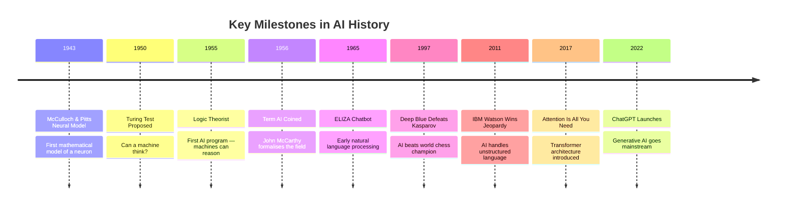
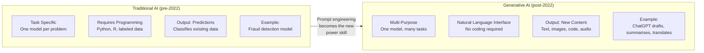
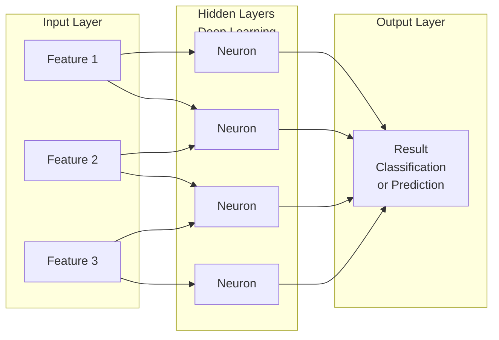
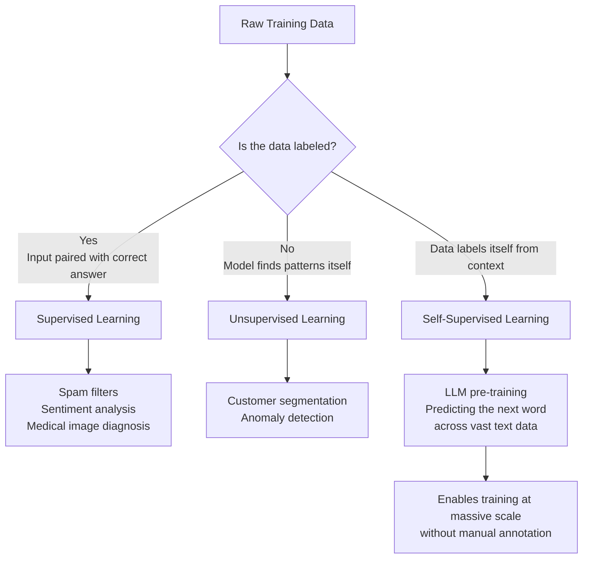
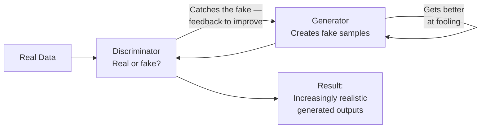
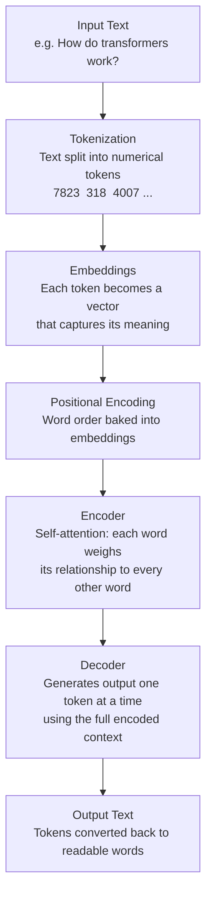
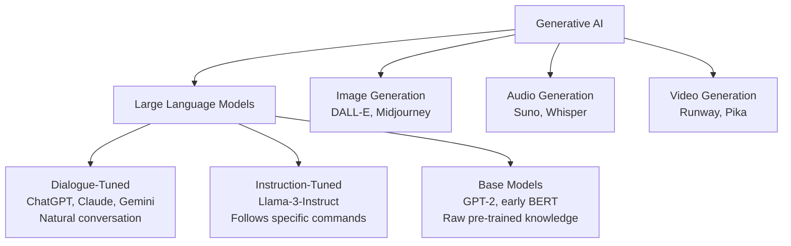
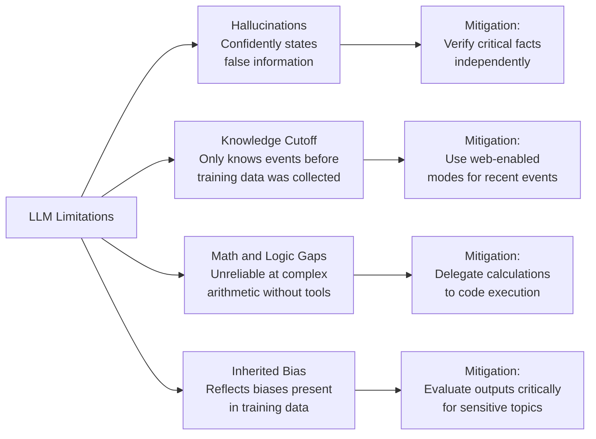

# AI Fundamentals

## Overview

This document covers the foundational concepts behind Artificial Intelligence — what it is, how it evolved, and how modern systems like large language models actually work under the hood. Understanding these fundamentals is what separates someone who uses AI tools from someone who can think critically about them.

---

## A Century of Predictions

In 1925, a British engineer named Archibald Low wrote a book predicting what life would look like in 2025. He imagined wall-mounted televisions, climate-controlled rooms, and instantaneous access to global information. Nearly everything he predicted came true.

What he got wrong? He thought every man in 2025 would be bald from wearing hats too often.

The point isn't that he was a prophet — it's that *transformative technology often arrives sooner than sceptics expect and differently than optimists imagine*. AI is no different.

---

## A Timeline of AI Milestones

AI didn't emerge overnight. It was built across decades of incremental breakthroughs:

There were also *AI winters* — periods in the 1970s–80s when funding dried up and progress stalled, mostly because hardware wasn't powerful enough and data wasn't plentiful enough. The lesson: good ideas still need the right infrastructure to flourish.

---

## What Is Artificial Intelligence?

At its core, AI is **the simulation of human intelligence in machines** — building systems that can learn from experience, reason about problems, and adapt to new situations.

A useful analogy: imagine you've been asked to learn and explain a topic you've never studied before — say, aerospace engineering. You'd read books, search for articles, synthesize notes, and then explain the concept in your own words. You wouldn't copy-paste; you'd genuinely generate an understanding. That's what AI aims to replicate.

---

## Traditional AI vs. Generative AI

This distinction is critical to understand, especially for career positioning.

The shift from Traditional to Generative AI is what made **prompt engineering** the new power skill. You no longer need to code a model; you need to know how to communicate with one.

---

## How the Brain Inspired Neural Networks

The human brain has roughly 100 billion neurons. Each neuron receives signals through its dendrites, processes them in its nucleus, and sends output down its axon to the next neuron. Connections strengthen or weaken based on experience — that's how learning happens. Artificial Neural Networks mirror this structure directly.

The more hidden layers a network has, the "deeper" it is — hence the term **Deep Learning**. Deep networks can model complex, non-linear patterns in data that shallow networks miss.

> **Key stat:** GPT-3 has 175 billion parameters — the adjustable weights across all connections. That exceeds the estimated 100 billion neurons in a human brain, though the comparison isn't perfectly apples-to-apples.

**Real-world example — Tesla Autopilot:**
Camera input → Deep neural network → Identifies lanes, pedestrians, traffic signs → Calculates steering, braking, and acceleration — all within milliseconds.

---

## How AI Learns: Three Training Paradigms

Understanding how models are trained helps you use them more intelligently.

**1. Supervised Learning** — The model trains on labeled examples, like a student studying with an answer key. Powerful but expensive — requires humans to label thousands or millions of data points.

**2. Unsupervised Learning** — The model finds patterns without being told what to look for. Think of sorting a mixed bag of items by similarity without knowing their names.

**3. Self-Supervised Learning** — The model generates its own labels from raw data. The surrounding text in a sentence *is* the label. This is how LLMs are pre-trained and why they can learn from virtually unlimited data.

---

## Generative Models — How AI Creates

The question many people ask: is AI just copy-pasting from its training data? The answer is no.

Generative models learn the *underlying patterns* of data, not specific examples. Once trained, they produce entirely new outputs that fit those patterns.

**Analogy:** Show a child hundreds of photos of animals. After a while, ask the child to draw an animal they've never seen. They'll draw something plausible — four legs, fur, eyes — because they've internalized the *rules*, not the *images*. AI works the same way.

**Two key generative architectures before Transformers:**

**GANs (Generative Adversarial Networks)**

Famous example: [thispersondoesnotexist.com](https://thispersondoesnotexist.com) — every face shown is AI-generated from scratch using a GAN.

**VAEs (Variational Autoencoders)**
- The *Encoder* compresses an input (e.g. an image) into a compact representation
- The *Decoder* reconstructs the image from that compressed form
- Key use: Image compression — reducing a 2MB photo to 80KB without visibly degrading quality
- Also used in anomaly detection and drug discovery

---

## Transformers — The Architecture Behind Modern AI

The 2017 Google paper *"Attention Is All You Need"* changed everything. It introduced the **Transformer architecture**, which underpins virtually every major LLM today: ChatGPT, Claude, Gemini, Llama, and more.

**What made Transformers different:**
- Older models (RNNs) processed text *sequentially* — one word at a time, left to right
- Transformers process the *entire input simultaneously*, making them dramatically faster and better at capturing long-range context

**Self-attention in plain terms:** In the sentence "The trophy didn't fit in the suitcase because *it* was too big," self-attention is what allows the model to determine that "it" refers to the trophy and not the suitcase — by weighing the relationship between every word in the sentence at once.

---

## Understanding LLMs

LLMs (Large Language Models) are a specific category within Generative AI — focused on text understanding and generation. At their core, LLMs do one thing: **predict the next most likely token** given everything that came before.

**Why don't LLMs always give the same answer?**
By design. LLMs sample from a probability distribution rather than always selecting the single most likely word. This is controlled by a **temperature** setting — lower temperature produces more deterministic and factual responses; higher temperature produces more creative and varied ones.

---

## Limitations to Know

---

## Key Takeaways

1. **AI is pattern recognition at scale**, not magic. Understanding how neural networks learn makes you a sharper user and a more credible communicator of AI's capabilities and limits.

2. **The shift from Traditional to Generative AI is a shift in accessibility.** The barrier moved from coding skills to communication skills.

3. **Transformers are the backbone of modern AI.** The self-attention mechanism is what allows models to understand context across an entire input — not just word by word.

4. **LLMs are probabilistic, not deterministic.** They don't look up answers — they generate the most statistically likely continuation of your input.

---

## Resources

- [The Illustrated Transformer](https://jalammar.github.io/illustrated-transformer/) — Visual walkthrough of the Transformer architecture
- [Transformer Explainer](https://poloclub.github.io/transformer-explainer/) — Interactive animation
- [OpenAI Tokenizer](https://platform.openai.com/tokenizer) — See how text becomes tokens in real time
- [ArtificialAnalysis.ai](https://artificialanalysis.ai) — Compare LLM performance, speed, and cost

---

*Week 1 — AI Fundamentals*
