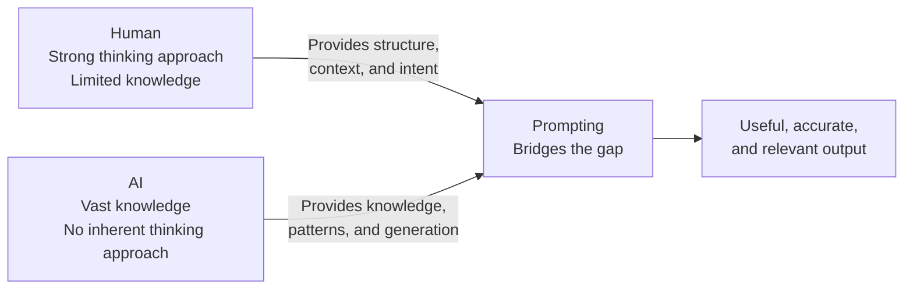
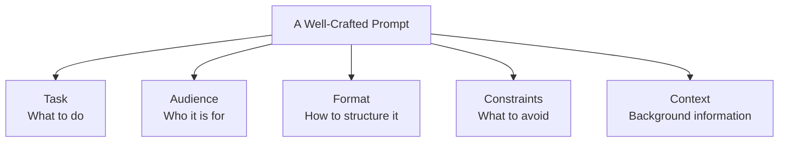
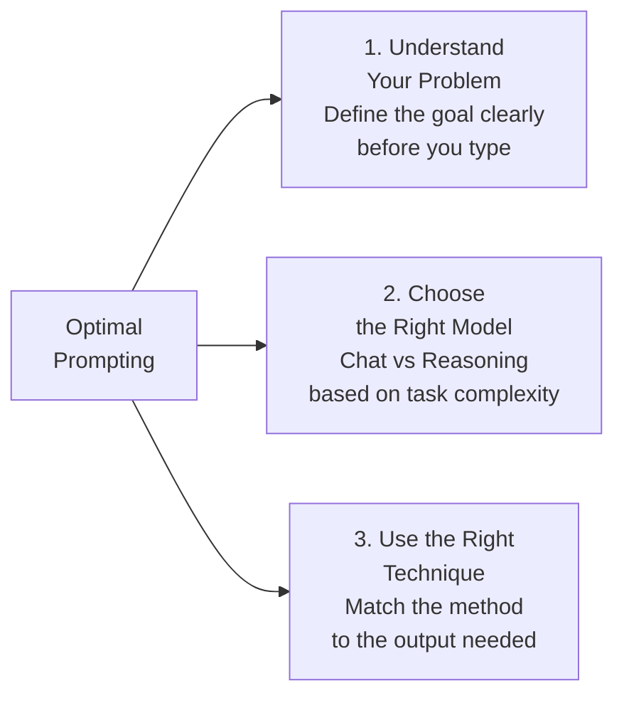
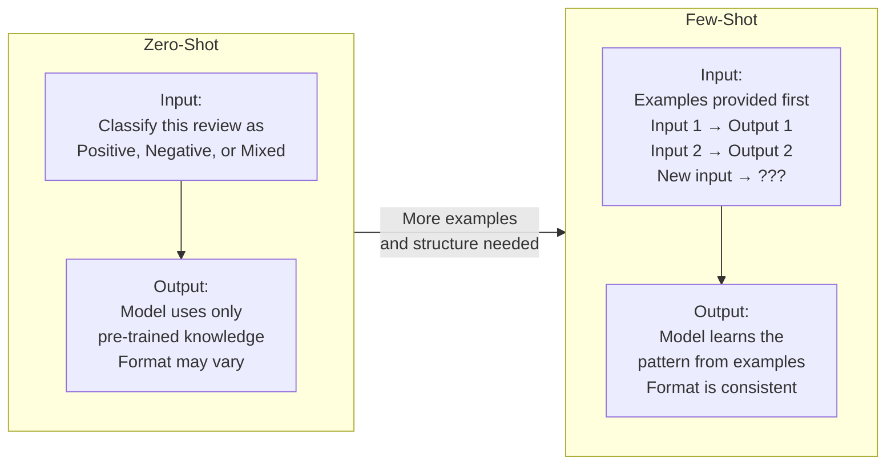
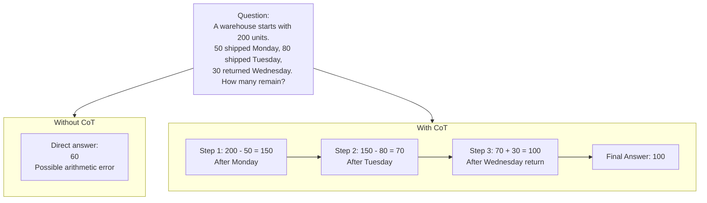
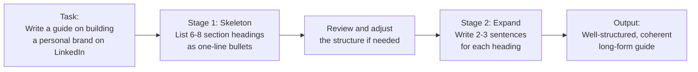
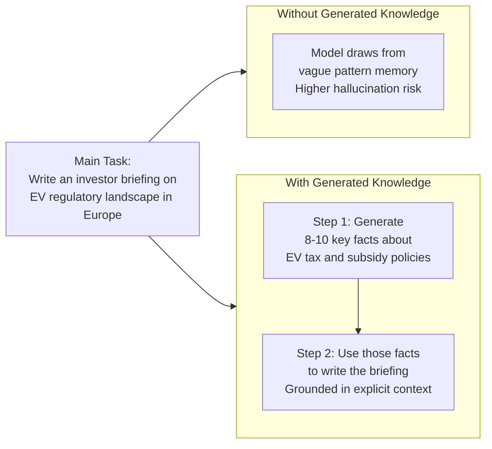
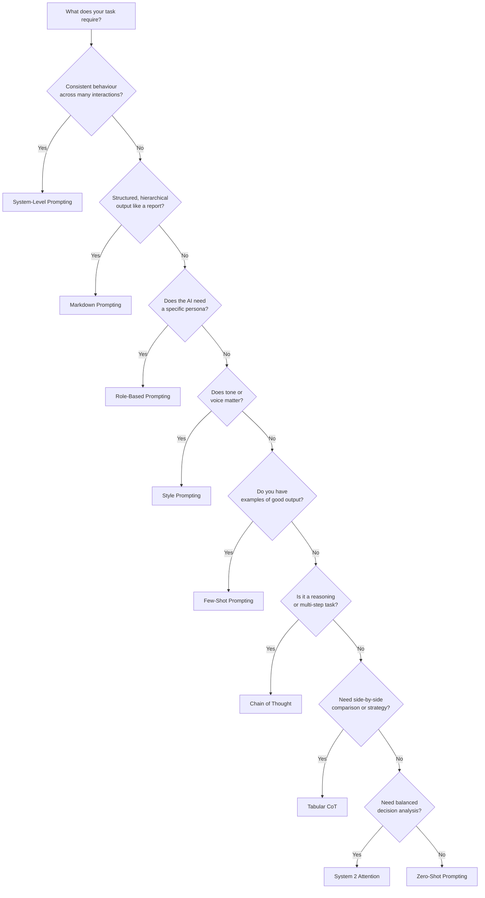

# Prompt Engineering

## Overview

Prompt engineering is the practice of structuring inputs to AI models in a way that reliably produces useful, accurate, and well-formatted outputs. This document covers the core techniques — from basic to advanced — along with practical examples and a reference guide for choosing the right approach.

---

## Why Prompting Is Harder Than It Looks

A study compared two groups of doctors: one group used an AI diagnostic tool, the other did not. The result? Both performed similarly — the AI group showed only a marginal improvement.

The reason wasn't that AI was unhelpful. It's that the doctors didn't know how to use it effectively. When the AI gave one wrong answer, they discounted everything else. They also treated it like a search engine — asking factual questions — rather than as a reasoning partner.

This captures a broader challenge most people face with AI:

- **Shallow interactions** — Poorly formed prompts produce mediocre results, leading people to dismiss the tool entirely
- **Mismatched expectations** — People expect a calculator and get a collaborator
- **Steep learning curve** — The interface looks simple (a text box), which paradoxically makes it harder — there is no obvious structure to follow



The core insight: **AI has vast knowledge but no inherent thinking approach. Humans have a thinking approach but limited knowledge. Prompting is what bridges the two.**

---

## What Is a Prompt?

A prompt is any instruction, command, or query given to an AI system. But more precisely, a well-crafted prompt is a structured communication that tells the AI exactly what it needs to know.



**The difference in practice:**

Vague:
```
Write something about climate change.
```

Structured:
```
You are an environmental journalist writing for a general audience.
Write a 200-word summary of the key causes of climate change using
everyday language and one concrete analogy. Avoid jargon. End with
a single actionable suggestion for readers.
```

The second prompt doesn't just get a better response — it gets a *predictable, reusable* one.

---

## Three Pillars of Optimal Prompting



**1. Understand Your Problem Statement**
Before writing a prompt, define what a successful output looks like. What constraints matter? What would make the output useless? Clarity before you type saves multiple rounds of iteration.

**2. Choose the Right Model**

| Model Type | Best For | Examples |
|---|---|---|
| Chat Models | Conversation, drafting, simple tasks | Gemini Flash, early GPT versions |
| Reasoning Models | Complex decisions, multi-step logic, constraint-heavy tasks | GPT-4o, Claude 3.5 Sonnet, Gemini 2.5 Pro, DeepSeek R1 |

For example: ask a chat model to suggest a home-based business with a $500 budget, legally registered and profitable within 30 days — and it may quietly violate your constraints. A reasoning model will evaluate each idea against every constraint before recommending it.

**3. Use the Right Technique**
Covered in detail in the sections below.

---

## Prompting Techniques

### 1. System-Level / Structural Prompting

Define a comprehensive role, ruleset, and objectives upfront — essentially a job description before the first task. This is the foundation for building specialized AI assistants that behave consistently.

```
<s>
You are a financial wellness coach for first-time earners aged 22–28.
Always follow these rules:
- Use plain language, no financial jargon
- Never give specific investment advice; recommend consulting a professional
- Keep responses under 150 words unless asked for more detail
- Always end with one practical action the user can take today
</s>

<task>
The user has just received their first salary. Help them think about how to allocate it.
</task>
```

---

### 2. Markdown Prompting

Structure your prompt using Markdown headings to dictate the structure of the output. The model mirrors the hierarchy you provide — useful for reports, briefs, and reusable templates.

```markdown
Act as a product manager writing a Product Requirements Document.

## Problem Statement
## Target Users
## Proposed Solution
## Success Metrics
## Out of Scope

Use bullet points under each heading. Be concise.
Product: A mobile app that helps remote workers track their focus time.
```

**Pro tip:** Use placeholders like `[Company Name]` or `[Product Type]` to turn any Markdown prompt into a reusable template — swap the values without rewriting the structure.

---

### 3. Role-Based Prompting

Assign a persona before giving the task. This focuses the model's knowledge and calibrates the tone of its response. Without a role, responses tend to be broad and encyclopaedic. With a role, they become focused and contextually appropriate.

```
You are a UX researcher at a fintech startup who just completed 20 user interviews.
Summarise the key friction points users experience during onboarding to a savings app.
Structure your summary as:
- Top 3 issues
- One representative quote per issue
- Recommended fix for each
```

---

### 4. Style Prompting

Specify the tone, genre, or voice explicitly. Critical for brand communications, content creation, and any output where how something is said matters as much as what is said.

Parameters to define:
- **Tone:** formal, casual, urgent, empathetic, sarcastic, motivational
- **Audience:** technical, general, executive, academic
- **Format:** bullet points, short paragraphs, script, social post

```
Write a LinkedIn post about the value of asking better questions.
Tone: conversational but insightful
Voice: a thoughtful practitioner, not a self-help guru
Length: 120 words maximum
End with a question that invites comments.
```

---

### 5. Rephrase and Respond Prompting

Ask the model to restate or reframe your question before answering it. This improves clarity and catches ambiguity before it shapes the response.

Useful variations:
- *"Rephrase and expand this question, then respond."*
- *"Reframe with additional context and detail before answering."*
- *"Modify the original question for precision, then provide your answer."*

Best used when turning a rough hypothesis into a research-quality statement, or making a blunt assertion suitable for a formal context.

---

### 6. Zero-Shot vs. Few-Shot Prompting



**Zero-Shot** — Ask the model to complete a task with no examples. Best for simple, well-defined tasks where the model has strong prior knowledge.

**Few-Shot** — Provide two to four examples of the desired input/output pattern before the actual task. The model learns the format and tone from your examples within the prompt itself.

| Use When | Choose |
|---|---|
| Task is simple and well-defined | Zero-Shot |
| Format consistency or nuanced tone matching matters | Few-Shot |

---

### 7. Chain of Thought (CoT) Prompting

Instruct the model to think step-by-step before delivering its final answer. This dramatically improves accuracy on reasoning-heavy tasks and makes the model's logic visible.

Trigger phrase: *"Think through each step logically and explain your reasoning at each stage."*



---

### 8. Skeleton of Thought (SoT) Prompting

A two-stage approach: generate the outline first, then fill in the detail. Ensures comprehensive coverage before committing to depth.



This mirrors how experienced writers plan — structure first, then content. It also lets you review and adjust the outline before any detailed generation happens.

---

### 9. Tabular Chain of Thought

A CoT variant where reasoning is structured as a table. Useful for comparisons, strategy, and trade-off analysis where side-by-side evaluation matters.

```
Create a competitive analysis for a new productivity app.
Use a table with these columns:
Competitor | Key Strengths | Key Weaknesses | Target Audience | Pricing | Gap We Can Fill

Think through each competitor logically before filling in each row.
```

---

### 10. System 2 Attention Prompting

Named after Daniel Kahneman's framework — System 1 being fast and intuitive, System 2 being slow and deliberate. Instructs the model to reason carefully and weigh trade-offs before making any recommendation.

```
Act as a strategic advisor. A startup is choosing between 3 markets to enter first:
Southeast Asia, Western Europe, or East Africa.

Before recommending anything, work through these steps:
1. Identify 4–5 key market entry factors
2. For each region, list pros and cons on those factors
3. Explicitly reason through trade-offs
4. Reflect on second-order effects (regulatory risk, talent pipeline, brand perception)

Only after completing this analysis, provide a ranked recommendation with justification.
```

---

### 11. Generated Knowledge Prompting

Ask the model to generate relevant background knowledge *before* tackling the main task. This grounds the response and reduces the likelihood of hallucination.



---

### 12. Self-Generated In-Context Learning

A way to get few-shot quality prompting without having ready-made examples. Ask the model to generate its own examples first, then use them to complete the task.

```
Step 1: Generate 3 examples of concise, data-backed performance review
comments — one for an employee who exceeded targets, one who met them,
one who fell short.

Step 2: For each example, note what made it effective (specific,
evidence-based, actionable).

Step 3: Using those examples as your style guide, write a performance
review for [employee description].
```

---

## Quick Reference: When to Use Which Technique



| Technique | Best For | Key Signal |
|---|---|---|
| System-Level | Specialized assistants with consistent behaviour | "I want the same rules applied across all interactions" |
| Markdown | Reports, analyses, reusable templates | "I need structured, hierarchical output" |
| Role-Based | Focused, persona-appropriate responses | "I need the AI to think like a specific expert" |
| Style | Brand content, scripts, audience-specific writing | "The tone and voice matter as much as the content" |
| Zero-Shot | Simple, well-understood tasks | "The task is straightforward" |
| Few-Shot | Consistent format, nuanced tone matching | "I have examples of what good looks like" |
| Chain of Thought | Reasoning, math, multi-step decisions | "I need accuracy and transparent logic" |
| Skeleton of Thought | Long-form documents, plans, presentations | "I want structure before depth" |
| Tabular CoT | Comparisons, strategy grids | "I need side-by-side reasoning" |
| System 2 Attention | Strategic decisions, trade-off analysis | "Show your reasoning before giving an answer" |
| Generated Knowledge | Research-grounded outputs | "I need the response anchored in facts" |
| Self-Generated ICL | Few-shot without prior examples | "I want few-shot quality but have no examples ready" |

---

## Key Takeaways

1. **A prompt is a specification, not a question.** The more context, structure, and constraints you provide, the more predictable and useful the output.

2. **Prompting is a skill, not a trick.** It improves with deliberate practice and reflection on what worked and why.

3. **Choose your model for the task.** Reasoning models are worth the extra cost for complex, multi-constraint problems. Chat models handle simple tasks well.

4. **Techniques compound.** A single effective prompt often combines Role + Style + CoT + Markdown. Think of them as modular tools, not exclusive categories.

5. **Use AI to improve your prompts.** Asking the model to act as a prompt engineer — reviewing and restructuring your input — is itself a valid and powerful technique.

---

## Resources

- [Anthropic Prompting Guide](https://docs.anthropic.com/en/docs/build-with-claude/prompt-engineering/overview)
- [Google Prompt Engineering Guide](https://cloud.google.com/discover/what-is-prompt-engineering)
- [OpenAI Prompting Best Practices](https://platform.openai.com/docs/guides/prompt-engineering)
- [PromptingGuide.ai](https://promptingguide.ai) — Comprehensive reference; best used as a lookup rather than read cover to cover
- [Snack Prompts](https://snackprompts.com) — Pre-built prompts for common use cases

---

*Week 1 — Prompt Engineering*
