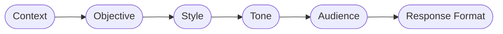
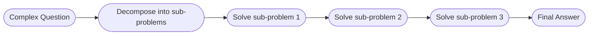
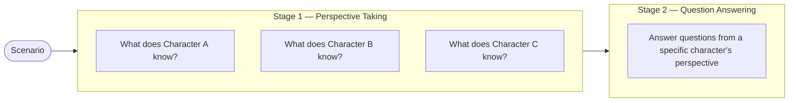
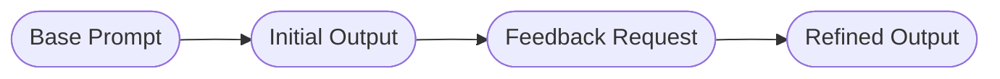
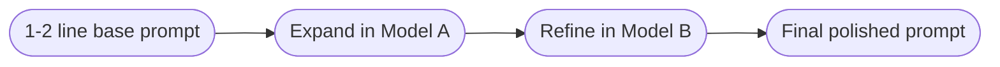

# Advanced Prompt Engineering

## Overview

Week 2 builds on the foundational prompting techniques covered in Week 1. The focus shifts to structured frameworks for complex reasoning, perspective-aware prompting, iterative refinement strategies, and practical workflows for generating high-quality prompts efficiently. These techniques are what separate casual AI users from practitioners who get consistently reliable results.

---

## Choosing the Right Model

Different AI models have distinct strengths — some excel at reasoning, others at creative writing, coding, or summarisation. Testing the same prompt across multiple models used to mean signing up for multiple tools and APIs.

**OpenRouter** ([openrouter.ai](https://openrouter.ai)) solves this by providing a single interface to compare models side by side. You write one prompt and see how GPT-4, Claude, Gemini, DeepSeek, Mistral, and others respond simultaneously. This makes it straightforward to identify which model fits a given task before committing to it.

| Model | Strengths | Best For |
|---|---|---|
| GPT-4o | Balanced, multimodal | Complex writing, image analysis, research |
| Claude 3.5 Sonnet | Safe, interpretive, strong reasoning | Coding, detailed explanations, analysis |
| Gemini 1.5 Pro | Document and video reasoning, large context | Long documents, YouTube summarisation |
| DeepSeek R1 | Reasoning, technical tasks | Math, logic, STEM problems |
| Perplexity | Real-time web search + synthesis | Fact-based research, current events |

---

## The CO-STAR Framework

CO-STAR is a structured prompt framework that won Singapore's national prompt engineering competition. It provides a mental checklist ensuring all critical dimensions of a complex request are covered before sending a prompt.



| Component | What It Defines | Example |
|---|---|---|
| **C — Context** | Background information and scenario details | "An American upskilling company expanding into Latin America in 2025..." |
| **O — Objective** | The specific goal to achieve | "Identify top entry markets, pricing strategy, regulatory requirements..." |
| **S — Style** | Writing style and approach | "Write as an experienced international business strategy consultant" |
| **T — Tone** | Emotional quality of the response | "Professional, analytical, data-driven" |
| **A — Audience** | Who the output is intended for | "C-suite executives making strategic decisions" |
| **R — Response Format** | Structure of the output | "Structured report with Executive Summary, Market Analysis, Risk Assessment" |

**How it differs from Markdown Prompting:** Markdown prompting structures the *output format*. CO-STAR structures the *entire input* — it ensures you've thought through context, goal, style, tone, audience, and format before asking anything. The two can be combined.

**When to use CO-STAR:** Complex, multi-part requests where a poorly framed prompt would produce a generic or misaligned answer — strategy documents, analysis reports, content briefs, research summaries.

**Example — Market Expansion Strategy:**

```
# CONTEXT
An American adult education company specialising in upskilling programs
is looking to expand into the Latin American market in 2025. Need to
understand regional education landscape, market dynamics, cultural nuances,
and competitive environment.

# OBJECTIVE
Develop a market entry strategy that identifies: the most viable countries
for initial entry, optimal business model adaptations, key partnerships,
pricing strategies considering local purchasing power, and regulatory needs.

# STYLE
Write as an experienced international business strategy consultant with
deep expertise in education markets and emerging economies.

# TONE
Professional and analytical, with a focus on data-driven insights and
practical recommendations.

# AUDIENCE
C-suite executives and senior management making strategic entry decisions.

# RESPONSE
A structured strategic analysis report including: Executive Summary,
Market Analysis & Opportunity Assessment, Entry Strategy Recommendations,
Risk Analysis, Implementation Roadmap, Key Success Metrics.
```

---

## Least to Most Prompting

Least to Most Prompting breaks a complex problem into simpler sub-problems and solves them **sequentially** — starting from the simplest prerequisite and building up to the final answer.

**How it differs from Chain of Thought:** CoT generates reasoning steps in one pass. Least to Most explicitly identifies *dependencies* first — what needs to be solved before the main question can be answered — and resolves each in order.



**Two-step process:**

**Step 1 — Decompose:** Ask the AI to identify what sub-problems must be solved before answering.

**Step 2 — Solve sequentially:** Ask the AI to resolve each sub-problem in order and use those results to answer the original question.

**Example — Customer Service Inquiry:**

A customer bought a shirt for $18 (originally $30, 40% off) on March 1st. A new 50% discount is now available. They want to return it and use store credit to buy two shirts. Today is March 29th.

*Step 1 prompt:*
```
You are a customer service agent. Returns are allowed within 30 days.
Today is March 29th. There is currently a 50% discount on all shirts.
Shirt prices range from $18–$100. Do not make up any discount policies.

Customer inquiry: [inquiry above]

What sub-problems must be solved before answering this inquiry?
```

*AI identifies:* Is the return window still valid? → What did the customer pay? → What is their store credit? → What is the price range after the new discount? → Can two shirts be purchased with that credit?

*Step 2 prompt:* "Solve all sub-problems in order and respond to the customer."

**Why it matters:** If the first check fails (return window expired), the AI stops and gives a clear reason — no unnecessary calculation. It mirrors how a well-trained customer service agent would actually reason.

**Best use cases:** Customer service logic, legal eligibility checks, financial calculations with prerequisites, any problem where later steps depend on earlier results.

---

## SimTom Prompting

SimTom stands for **Simulated Theory of Mind** — a psychological concept referring to the ability to attribute mental states (beliefs, intentions, knowledge) to other people, separate from your own.

Standard LLMs can confuse objective reality with what a *character in a scenario* actually knows. SimTom addresses this by forcing the AI to reason from each character's specific perspective before answering any question.

**Two-stage process:**



**Stage 1 prompt:**
```
The following is a sequence of events: [scenario]
Which events does [character name] know about?
```

**Stage 2 prompt:**
```
[Story from character's perspective]
Answer the following question: [question]
```

**Worked example — Workplace conflict:**

Ananya and Raj are working on a marketing campaign. Raj takes a late-night client call and updates the brief but forgets to tell Ananya. Ananya works the next day from the old brief. Raj criticises her work publicly. Their manager Priya privately tells Raj he forgot to share the update.

*Without SimTom:* The AI might explain the conflict from an all-knowing narrator's view, missing the nuance that Ananya had no way to know about the change.

*With SimTom:*
- **Ananya's perspective:** Worked diligently from the brief she had. Felt blindsided and publicly criticised for something she couldn't have known.
- **Raj's perspective:** Stressed from the client call, assumed the team would somehow know. Initially blamed Ananya before realising his own oversight.
- **Priya's perspective:** Witnessed the miscommunication, aware of Raj's mistake, concerned about team dynamics.

Stage 2 can then answer: "Why does Ananya feel Raj is being unfair?" — correctly, from her perspective alone.

**Best use cases:** Conflict resolution, character analysis, HR scenarios, customer complaint analysis involving multiple parties, negotiation preparation.

---

## Verification and Refinement Strategies

A single prompt rarely produces perfect output for complex tasks. These three techniques create systematic improvement loops — each targeting a different failure mode.

| Method | What It Fixes | How It Works |
|---|---|---|
| **Self-Refine** | Output quality and persuasiveness | AI critiques its own output, then rewrites based on that feedback |
| **Self-Verification** | Logical consistency across multiple reasoning paths | AI generates several candidate answers, then evaluates which is best |
| **Chain of Verification (CoVE)** | Factual accuracy and hallucination | AI fact-checks each claim with targeted questions before finalising |

---

### Self-Refine

Self-Refine runs the AI through three passes: generate, critique, rewrite.



**Step 1 — Generate:**
```
Write a product description for ChronoX smartwatch — tracks health
metrics, week-long battery life.
```

**Step 2 — Request feedback:**
```
Here is the product description: [paste Step 1 output]

Give constructive feedback to make this more engaging and persuasive
for online shoppers.
```

**Step 3 — Refine:**
```
Based on this feedback: [paste Step 2 output]

Rewrite the original product description to incorporate it.
```

**Why copy-paste rather than continue in the same conversation?** It ensures the AI has the full text in context. It also allows you to carry the output across different models — generate in Gemini, refine in Claude.

**Limitation:** Quality depends on the base model's ability to self-critique. If the initial output is very poor, feedback may also be generic.

---

### Self-Verification

Self-Verification generates multiple candidate answers using different reasoning approaches, then evaluates them to find the most reliable one.

**Step 1 — Forward reasoning (generate candidates):**
```
A train travels 60 miles per hour. How long does it take to travel
180 miles?

Think step-by-step and provide 3 candidate answers using different
reasoning styles. Label them Candidate 1, Candidate 2, Candidate 3.
```

**Step 2 — Backward verification (evaluate):**
```
Given these three candidate answers, analyze each for correctness,
logic, and clarity. Which is correct and why?
```

**Why this works:** When candidates disagree, the verification step surfaces which reasoning path broke down. When they agree, it increases confidence in the answer. The technique is especially useful for problems where multiple valid approaches exist.

**Limitation:** Increases token usage — three answers plus an evaluation costs significantly more than a single response.

---

### Chain of Verification (CoVE)

CoVE is the most rigorous of the three. It explicitly forces the AI to fact-check each individual claim before producing a final answer.

**Four steps:**

**Step 1 — Baseline response:**
```
List notable inventions of the 20th century.
```
*AI responds:* Internet, Quantum Mechanics, DNA Structure Discovery, Penicillin...

**Step 2 — Plan verification questions:**
```
Create targeted questions to fact-check each item in the list
regarding its 20th-century origin.
```
*AI generates:* "Was the Internet invented in the 20th century?" / "Was Quantum Mechanics developed in the 20th century?" etc.

**Step 3 — Execute verification independently:**
```
Answer each verification question independently.
```
*AI checks each claim against its knowledge base.*

**Step 4 — Generate final verified response:**
```
Revise the list based only on the verified facts.
```
*AI produces a corrected, fact-grounded list.*

**Best use cases:** Factual research, historical claims, legal or compliance content, medical information, any output where accuracy matters more than speed.

---

## Prompt Creation Workflows

Rather than constructing every complex prompt manually from scratch, these workflows use AI to generate and refine prompts for you.

### Workflow 1 — Expand and Refine Across Models



1. Write a 1–2 line description of your task
2. Ask Model A (e.g., Gemini) to expand it into a structured Markdown prompt with sections for Role, Objective, Context, Instructions, Notes
3. Copy the expanded prompt into Model B (e.g., Claude) and ask it to refine the tone, clarity, and specificity for its own capabilities

**Why use two models:** Different models have different strengths. Gemini is strong at structuring; Claude is precise about instruction clarity. Using both produces a more robust final prompt than either alone.

---

### Workflow 2 — Adapt from a Proven Example

1. Write your base task in 1–2 lines
2. Find a prompt you've used before that produced excellent results (for a different task)
3. Paste the example prompt and instruct the AI: *"This is a format I like. Adapt my base task into the same structure."*

**Example:**

*Base task:* A D2C skincare app wants to launch a personalised morning skincare routine planner. Need a feature brief for the product and design teams.

*Example prompt provided:* A detailed feature brief prompt for a hydration reminder tool (different product, same structure — user problem, persona, functionality, user story).

*Instruction:* "Adapt the base task above to follow the format and flow of this example."

**Why this works:** It reuses proven prompt architecture rather than rebuilding from scratch. Over time, building a personal library of effective prompts makes this workflow faster and more reliable.

---

## Key Takeaways

1. **CO-STAR is a thinking framework, not just a format.** It forces you to define context, goal, style, tone, audience, and output structure before typing a single word of instruction — resulting in dramatically more relevant responses.

2. **Least to Most is the right tool for sequential logic.** When later steps depend on earlier ones being resolved first, explicitly decomposing the problem and solving in order produces more reliable and auditable results than a single-pass CoT.

3. **SimTom solves the perspective problem.** Any scenario involving multiple people with different information requires SimTom. Standard prompting defaults to an omniscient narrator view — which is often wrong for conflict analysis, negotiation prep, or storytelling.

4. **Refinement is a workflow, not a fallback.** Self-Refine, Self-Verification, and CoVE are not fixes for bad prompts — they are deliberate strategies for tasks where quality and accuracy matter enough to justify the extra steps.

5. **Use AI to build prompts.** The two workflows above mean you rarely need to write a complex prompt entirely from scratch. A 1–2 line description is enough to get started.

---

## Resources

- [OpenRouter](https://openrouter.ai) — Compare multiple models with one prompt
- [Google AI Studio](https://aistudio.google.com) — Free access to Gemini models
- [Anthropic Prompting Guide](https://docs.anthropic.com/en/docs/build-with-claude/prompt-engineering/overview)
- [PromptingGuide.ai](https://promptingguide.ai) — Comprehensive technique reference

---

*Week 2 — Advanced Prompt Engineering*
