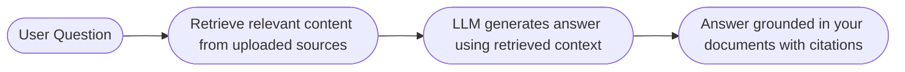
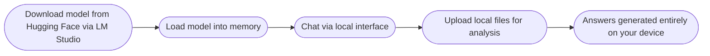
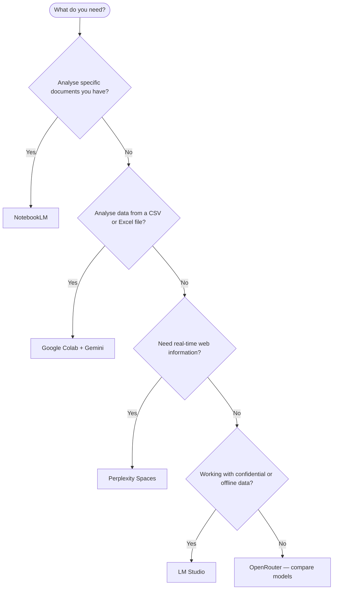

# From Prompting to Prototyping

## Overview

Knowing how to write good prompts is the foundation. This document covers the next layer — AI-powered tools that transform prompting into something more tangible: personalised research assistants, automated data analysis, locally running models, and custom AI workspaces. Each tool here represents a practical application of everything covered in the prompting sessions.

---

## The Research Problem

Traditional research looks like this: open a search engine, visit twenty websites, read each one, synthesise the information manually, repeat. For fast-moving topics — AI developments, competitive landscapes, academic literature — this process is slow and inefficient.

AI tools don't just answer questions faster. They change the unit of work entirely. Instead of reading sources, you upload them and ask questions. Instead of synthesising manually, you get structured summaries with citations. The researcher's job shifts from information gathering to asking the right questions.

---

## Google NotebookLM

NotebookLM ([notebooklm.google.com](https://notebooklm.google.com)) is a research and knowledge management tool built on Gemini. It is not an LLM itself — it is an application that creates a **personalised knowledge base** from sources you provide, then lets you query, summarise, and analyse that specific content.

### What makes it different from ChatGPT

| Feature | NotebookLM | ChatGPT |
|---|---|---|
| Knowledge source | Only your uploaded sources | Internal training + web search |
| Citations | Every answer links back to the source | Inconsistent |
| Context capacity | Up to 50 sources, ~25 million words total | Limited file uploads |
| Hallucination risk | Lower — grounded in your documents | Higher for specific facts |
| Best for | Deep analysis of known, specific sources | General questions, broad knowledge |

### What you can upload

PDFs, text files, Markdown files, Google Docs, Google Slides, website URLs, YouTube video links, audio files.

### How to use it effectively

Upload your sources first, then ask questions as if you're talking to someone who has read everything you uploaded.

**Example — Personal health assistant:**

Upload your medical reports (blood count, MRI, cholesterol panels) alongside YouTube videos from trusted health professionals. Then ask:

```
Summarise key metrics from my health report — blood pressure, cholesterol,
blood sugar — and highlight any values outside the normal range.

Based on the spinal report and general health report, are there any
potential correlations I should be aware of?

What questions should I ask my doctor at my next appointment based on
these findings?
```

NotebookLM answers from your documents, cites the exact source, and never fabricates values it didn't find in the uploaded files.

**Example — Car owner's manual:**

Upload your vehicle manuals. Ask: "What engine oil type and change interval does the manufacturer recommend?" — instant, specific answer without reading 400 pages.

### Additional features

**Audio Overview** — converts uploaded text-heavy documents into a conversational podcast format with two AI hosts discussing the content. Useful for digesting dense material while commuting.

**Mind Map** — generates a visual map of key concepts and their relationships from your documents. Good for navigating complex research papers or understanding the structure of a field.

**Timeline** — identifies dates across uploaded documents and arranges key events chronologically. Useful for tracking the evolution of research, project history, or medical history across multiple reports.

---

## Understanding RAG

NotebookLM is powered by a technique called **Retrieval-Augmented Generation (RAG)**.

Standard LLMs answer questions using only what they learned during training — which has a cutoff date and no knowledge of your private documents. RAG changes this by adding an external knowledge retrieval step before generating an answer.



**Why RAG matters:**
- Answers are grounded in specific, verifiable sources — not the model's general memory
- Private or proprietary documents can be queried without being part of training data
- Knowledge can be updated simply by uploading new documents
- Citations allow easy verification

ChatGPT with web search enabled also uses a form of RAG — the search results serve as the retrieved context. The difference is that NotebookLM gives you full control over which sources are used.

---

## Google Colab for Data Analysis

Google Colab ([colab.research.google.com](https://colab.research.google.com)) is a free, browser-based Python environment. Its integration with Gemini allows you to analyse data using natural language — no coding expertise required to get started.

### How it works

Upload a CSV or Excel file, write a prompt describing what you want to learn from the data, and Gemini generates and executes Python code to produce the analysis.

**What makes Colab different from ChatGPT for data analysis:**

| Feature | Colab + Gemini | ChatGPT Data Analysis |
|---|---|---|
| Code visibility | Full code shown and editable | Largely hidden |
| Debugging | Built-in "Explain Error" feature | Manual copy-paste |
| Reusability | Download notebook as .ipynb or .py | Results not portable |
| Trust | Verify every step of the analysis | Black box execution |
| Depth | Often produces deeper, structured analysis | Good for quick answers |

### Simple vs. structured prompting

**Simple prompt:**
```
Give me a summary of this data.
```
Colab responds with an execution plan: load data → explore structure → clean → analyse → visualise → complete. After confirmation, it executes each step and displays results automatically.

**Structured CO-STAR prompt:**
```
# CONTEXT
As Head of Sales, preparing a CEO presentation, I need to analyse
sales data using the Pyramid Principle — key message first, supported
by data.

# OBJECTIVE
Identify the key business story, covering: overall performance,
regional trends, product performance, and customer analysis.
Include KPIs: win rate, deal size, CLTV, pipeline velocity.

# STYLE
Experienced management consultant specialising in data-driven
executive storytelling.

# TONE
Strategic and analytical, focused on business impact.

# AUDIENCE
Head of Sales (myself) and CEO receiving the final presentation.

# RESPONSE
Structured analysis questions organised as: top-level business
questions, supporting metrics, deep-dive areas, suggested
visualisations, hypotheses to test.
```

The structured prompt produces a more comprehensive execution plan — including predictive modelling, feature engineering, and business-framed KPIs — rather than generic descriptive statistics.

### What Colab can produce

- Summary statistics and data quality reports
- Bar charts, line graphs, heatmaps, scatter plots
- Regional and product performance breakdowns
- Customer segmentation analysis
- Predictive models (e.g., sales forecasting with regression)
- Downloadable visualisations for use in presentations

---

## LM Studio — Running AI Locally

LM Studio ([lmstudio.ai](https://lmstudio.ai)) is a desktop application that lets you download and run open-source LLMs entirely on your own machine — no internet required, no data leaving your device.

### Why run AI locally

| Scenario | Why Local Matters |
|---|---|
| Confidential company data | Nothing uploaded to external servers |
| No internet access | Works offline on flights, remote locations |
| Private personal documents | Medical records, financial data, personal notes |
| Experimentation | Test and compare open-source models freely |

### How it works



### Choosing a model

LM Studio shows model size, download size, and a hardware compatibility indicator based on your system's RAM. A practical guide:

| RAM Available | Suitable Model Size | Examples |
|---|---|---|
| 8GB | Up to ~4B parameters | Phi-3 Mini, Gemma 2B |
| 16GB | Up to ~7–8B parameters | Llama 3.1 8B, Mistral 7B, DeepSeek 7B |
| 32GB+ | Up to ~13–30B parameters | Llama 3 70B (quantised), Qwen 14B |

### What local models can do

- Answer general knowledge questions (within training data cutoff)
- Analyse uploaded local files: PDFs, text files, CSVs
- Run without any API key or subscription
- Process sensitive documents with full privacy

**Limitation:** Local models have a training data cutoff and cannot access the internet. They are best for tasks that don't require real-time information.

### LM Studio vs. NotebookLM

| | LM Studio | NotebookLM |
|---|---|---|
| Privacy | Maximum — fully local | Cloud-based (Google servers) |
| Internet required | No | Yes |
| Source control | Upload local files | Upload various source types |
| Setup effort | Download and install app | Web-based, immediate |
| Best for | Confidential data, offline use | Research synthesis, rich media |

**Alternative:** GPT4All ([gpt4all.io](https://gpt4all.io)) offers a similar local LLM experience and is recommended for users on older hardware or Intel Macs where LM Studio may not be fully compatible.

---

## Perplexity Spaces

Perplexity ([perplexity.ai](https://perplexity.ai)) is an AI search engine — not a standalone LLM. It combines real-time web search with access to multiple underlying models (GPT-4, Claude 3, Gemini, Sonar) and selects the most appropriate one for each query.

Its key differentiator is **citation quality**. Perplexity consistently surfaces more authoritative and relevant sources than standard LLM web search.

**Perplexity Spaces** take this further — they allow you to create a dedicated, persistent AI assistant for a specific domain or persona.

### How Spaces work

1. **Name the space** (e.g., "Financial Advisor", "Marketing Strategist")
2. **Write a system prompt** defining the AI's role, expertise, and behaviour
3. **Optionally upload files** or specific URLs as additional context
4. **Query within the space** — every response combines your persona definition with real-time web research

### Example — Financial Advisor Space

**System prompt:**
```
You are an AI investment analyst specialising in the Indian stock market
(NSE/BSE). Provide actionable insights grounded in current financial data.
Consider tax implications, risk profiles, and regulatory frameworks.
Always cite sources and distinguish between short-term and long-term
recommendations.
```

**Query:** "I have ₹10,000 INR to invest monthly. How should I build my portfolio?"

**Response:** Detailed step-by-step allocation (debt vs. equity ratio, specific mutual fund categories for different risk profiles, suggested platforms) — synthesised from 20+ live sources including Groww, ET Money, Zerodha.

**Query:** "Is now a good time to invest in Dmart stock?"

**Response:** Current financial overview (Q4 results, revenue growth, P/E ratio vs. fair value), analyst consensus, market sentiment — from ~35 real-time sources.

### Spaces vs. NotebookLM

| | Perplexity Spaces | NotebookLM |
|---|---|---|
| Information source | Real-time web search | Your uploaded documents |
| Best for | Current events, market data, live research | Specific, private, or archival sources |
| Persistence | System prompt carries across sessions | Notebook maintains uploaded sources |
| Citation quality | Excellent — curated live sources | Precise — links directly to source text |

### Adapting a Space to a new context

Once you have a well-written system prompt, you can quickly adapt it to a new market or domain by asking the AI to convert it:

```
Convert this Indian stock market financial advisor prompt to a
US Nasdaq financial advisor. Update all references, regulations,
platforms, and terminology accordingly.
```

This reuses your existing prompt engineering work rather than starting from scratch.

---

## Gemini Features Worth Knowing

### YouTube Video Analysis

Google AI Studio allows you to paste a YouTube URL directly into a prompt. Gemini processes the video audio and generates:

- Full time-stamped transcripts (including multilingual content)
- Scene-by-scene summaries
- Bullet-point action items
- Content repurposed for social media or meeting notes

This is particularly useful for long webinars, conference recordings, or research presentations that would take hours to watch and manually summarise.

### Gemini Live

Gemini Live allows real-time, voice-based interaction with screen sharing. You can share your screen — a spreadsheet, a piece of code, a website, a presentation — and talk to Gemini about what you're looking at.

**Practical uses:**
- Explaining code in a file you have open
- Getting feedback on a dashboard or chart you're building
- Talking through a document while it's displayed
- Debugging errors with live context

Both features are available free via [Google AI Studio](https://aistudio.google.com).

---

## Choosing the Right Tool



---

## Key Takeaways

1. **NotebookLM is the most underrated free research tool available.** The ability to upload 50 sources and query across 25 million words — with precise citations — changes how research works.

2. **RAG is the mechanism behind grounded AI.** Understanding it explains why NotebookLM answers differently from ChatGPT, and why adding sources to any AI system improves accuracy.

3. **Colab exposes what ChatGPT hides.** Seeing the generated Python code builds trust, enables verification, and makes analysis reproducible and portable.

4. **Local LLMs are the answer for private data.** If you have confidential documents, sensitive records, or simply no internet access, LM Studio brings capable AI entirely onto your own machine.

5. **Perplexity Spaces are reusable AI assistants.** A well-written system prompt becomes a persistent persona you can query repeatedly without re-explaining your context every time.

6. **The right tool depends on the task.** There is no single best AI tool — choosing correctly between NotebookLM, Colab, LM Studio, and Perplexity Spaces is itself a high-value skill.

---

## Resources

- [Google NotebookLM](https://notebooklm.google.com)
- [Google Colab](https://colab.research.google.com)
- [LM Studio](https://lmstudio.ai)
- [GPT4All](https://gpt4all.io) — Alternative local LLM tool
- [Perplexity](https://perplexity.ai)
- [Google AI Studio](https://aistudio.google.com) — Gemini Live and video analysis
- [OpenRouter](https://openrouter.ai) — Multi-model comparison
- [There's An AI For That](https://theresanaiforthat.com) — Discover AI tools by use case

---

*Week 2 — From Prompting to Prototyping*
